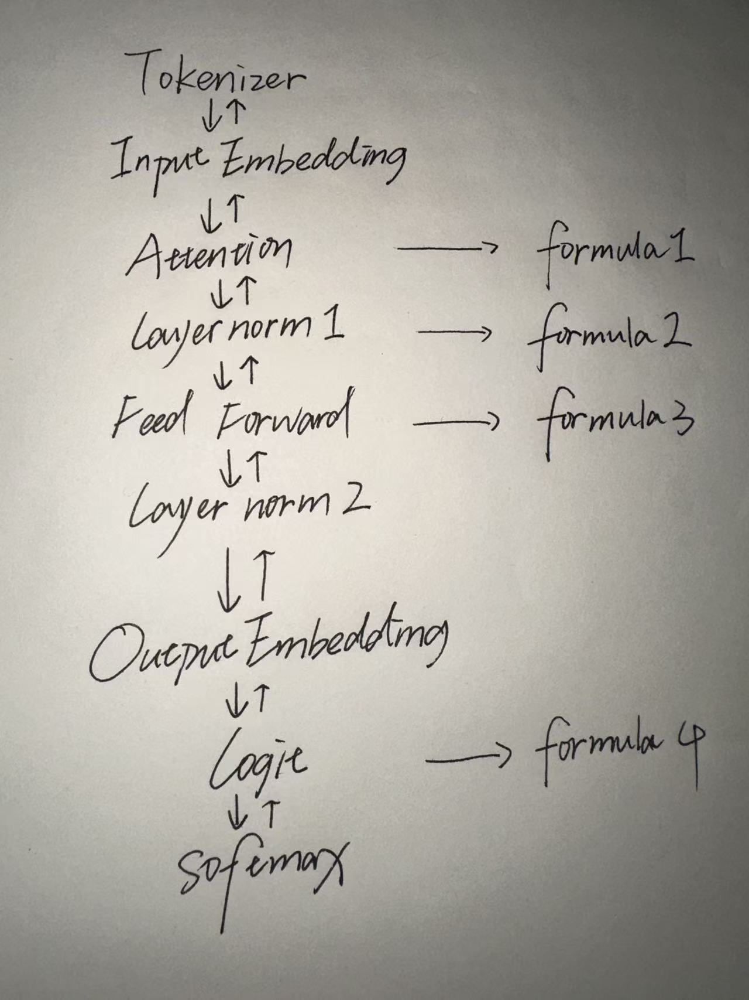

NumpyGPT

A Large Language Model built from first principles.

1. My Learning Story — From Zero to Building an LLM in 3 Months

" What I cannot create, I do not understand. 
                                         -- Richard Feynman "

Three months ago, I knew nothing about large language models.
I had no formal background in computer science, AI, or advanced mathematics.
Learning from school is too slow and boring.
So, I decided to understand LLMs by building one from scratch.

My approach was simple:

 one. Think from First Principles.
 two. Ask AI.

" I know that I know nothing.
                          -- Socrates "

Ask => Build => Break => Ask => Understand 

When I feel don't understand, ask and understand it. I ask until confusion turned into clarity.

With AI, Power of First Principle and Understand can rebuilt the earth.

2. Technical Philosophy — Building an LLM from First Principles

" First principles is kind of a physics way of looking at the world.
  You boil things down to the most fundamental truths and say,
  ‘What are we sure is true?’ and then reason up from there. 
  I approached this project using first principles thinking.
                                                                 -- Elon Musk "
                                                                                                       
If we strip AI down to its most irreducible facts:

At the software level, AI is matrix mathematics.
At the hardware level, AI is just a machine calculating those matrix operations.
In this project, I focused on the software truth:

An LLM is a mathematical formula.

So I started there.

Not from a framework.
Not from a pretrained model.
Not from PyTorch or TensorFlow abstractions.

Just NumPy.
Just mathematical formula.

This is four main formulas in transformer.
Reason up from there.

Technical Challenges I Faced
one. Vibe Learning, Not Vibe Coding

 I didn’t want to surrender technical control to AI.

 It would have been easy to generate code and move on.
 Instead, I forced myself to understand every tensor shape, every gradient, every multiplication.

 This slowed me down.
 But it built real understanding.

two. Learning Modularity Through Pain

 At the beginning, my code was chaotic:

 Massive files
 Entangled variables
 No abstraction boundaries
 When the model grew, the code collapsed under its own complexity.

 Through iteration (and AI guidance), I learned modular design:

 Separate layers
 Clean interfaces
 Reusable components
 Clear data flow
 This was not learned from a textbook.
 It was learned from debugging suffering.

 That is the power of learning by doing.

three. CPU Limitations

 This model runs only on CPU.

 It is not production-grade.
 It is not optimized for scale.
 It cannot compete with industrial LLMs.

 And that’s the point.

 numpyGPT is a demonstration project — proof of conceptual understanding and bottom-up construction.

3. What I Learned & What Comes Next
What I Learned
If you want to learn at extreme speed:

Do not wait until you “know enough.”
Do not finish every book before starting.
Do not prepare forever.

I never bought a single book for this project.

Instead:

Build something slightly beyond your ability.
Break it.
Ask AI why.
Understand the answer.
Repeat.
Knowledge sticks when it solves a real problem.

In this era, AI is not a replacement for thinking.
It is an accelerator for those who think.

If you use it actively — questioning, debugging, verifying —
you can compress the learning curve dramatically.

We live in a time where:

One person, with curiosity and AI, can recreate entire fields from scratch.

In some sense, you can build your own world again.

What Comes Next
This is only the beginning.

I will continue using this vibe learning by doing method:

Start from first principles.
Build from the bottom.
Understand every abstraction.
Next challenge:

Implementing an LLM that runs on GPU — from scratch.

No shortcuts.
Just deeper foundations.

Closing Thought
numpyGPT is not just a model.

It is a statement:

You don’t need permission.
You don’t need perfect preparation.
You don’t need to be a CS major.

You need curiosity, first principles thinking, and the courage to build before you feel ready.

If this README makes you think
“Maybe I could do this too.”

Then this project has already succeeded.